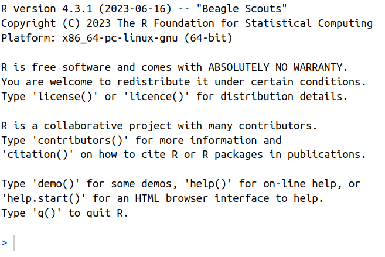

## Workshop Requirements

*NB: We are assuming that everyone will bring their own laptop. No laptops are able to be provided to attendees for this course.*

The workshop will require a working installation of 

- `R` v4.2.0 or later. The current version is 4.3.2 but this will not strictly be essential
- `RStudio`. There are no specific version requirements for today, but something installed within the last 18 months would be preferred

In addition the required `R` packages are 1) the `tidyverse` and 2) `rmarkdown`.
If you have both of these packages already installed, you will be prepared for the workshop and you don't need to change anything.

Otherwise, please follow the instructions below.
Help is available, should you need it during the half hour before the workshop commences.

| Day | Time | Location |
|:---- |:---- |:-------- |
| Tuesday 21st November | 8:30am - 9:00am | EZONE Building, University of Western Australia |

**It is essential that you have access to a working installation before the workshop begins.**
No time will be taken during the workshop to assist with this and *you will be significantly disadvantaged should you not have a working installation prior to attendance.*
Importantly, **installing R on a managed device can be unpredictably difficult or easy**, depending on the restrictions applied by your systems administrators.
Whilst not strictly an issue with `R` these restrictions can cause problems during installation.
*Please assume you have a difficult device and prepare early.*

If you require assistance, we are more than happy to help resolve any issues.
Otherwise, please [email](mailto:stephen.pederson@telethonkids.org.au)

## R Installation {.tabset}

R and RStudio are separate piece of software that both need to be installed.
RStudio will check for a working R installation, so please install R first.

### Self-Managed Laptop

Ubuntu/Mint users can follow instructions provided [here](https://cran.r-project.org/bin/linux/ubuntu/fullREADME.html).

For Windows/OSX users, `R` can be downloaded and installed from [CRAN](https://cran.r-project.org/).
Please choose the version for your operating system (OS).
`RStudio` can be downloaded and installed [Posit](https://posit.co/download/rstudio-desktop/) with options for most operating systems.


### Managed Devices

Both R and RStudio should be available in the Software Centre provided by your institution.
Please use these versions

### Using a Remote Installation

If the previous two options are not available to you, all local universities provide a remote desktop with access to R/RStudio.
It may be an older version, but will still be suitable for the workshop
These options are often known as `ADAPT`, `VirtualApps` or `Citrix`.
Please consider exploring these options if you need to.

If this is the best option for you, please place the above installation code into R (or the Console panel within RStudio), hitting `Enter` and letting the installation take place.
A failure of this installation is very unlikely, but if this does occur, please use the Posit Cloud as instructed below.

### Using the Posit Cloud

If all previous options have failed for you, a cloud instance is available from [Posit](https://posit.cloud/) as a *last resort.*
Almost all of the workshop will work successfully here, with the known exception being the creation of an R Project.
Everything else will run very well.

Once you have registered, go to `Your Workspace` and select `New Project` from the menu at the top RHS of the page, choosing "New R Studio Project".
In the `Console` section of the screen, please run the installation code below.
This should not fail as Posit has developed both the `tidyverse` and `rmarkdown`.
The installation code has also been tested on this system.

## Installing Packages

Once you have `R` installed, please open `R` using the {width="40px"} icon. 
Linux users should open a terminal and type `R`.
You should then see something which looks like the following

{width="60%"}

Please copy and paste the following where you see the `>` symbol, then hit the `Enter` key to begin the package installation.


```{r instal, eval=FALSE}
install.packages(c("tidyverse", "rmarkdown", "pander", "ggpmisc"))
```

You will need an internet connection and the installation may take up to 10 minutes.
A large amount of text will scroll past you as the installation takes place.

- You may receive a message asking if you'd like to update any packages and the wisest choice is to select "no" using `n`.
- If you see a message informing you that something has failed, please attend the drop-in session for help.


